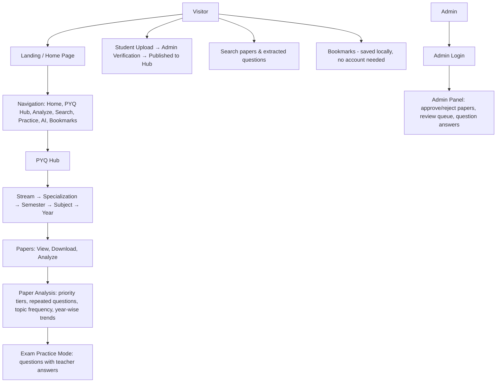

# Smart PYQ Project

**Smart PYQ** is an intelligent previous-year question paper (PYQ) platform for Osmania University. Students browse, upload, search, and download past exam papers organized by course, semester, and subject — and then go further: an AI engine extracts the actual questions from each paper, classifies them by topic and type, finds questions that repeat across years, ranks the most important topics, and helps students practice what matters.

The student platform is **public and account-free**: no login is needed to browse, analyze, practice, or bookmark. Authentication exists only for admins (paper approval, question answers, moderation).

## Supported Courses

- 🎓 B.Com
- 🎓 B.Sc
- 🎓 BCA
- 🎓 BBA

## Application Flow



## Features

- **PYQ Hub** — Browse previous-year papers by Stream → Specialization → Semester → Subject → Year. Students can also upload papers themselves (see below).
- **Paper Analysis** — A real data pipeline: reads the PDF, extracts each question with part/section, marks, type, and topic, then computes priority tiers (🔥 A / B / C from repetition × marks), repeated questions with per-year variants, topic frequency, marks weightage, year-wise breakdowns, exam focus, and a filterable Question Explorer. Single-paper analyses clearly show that repetition insights need multiple papers.
- **Standard paper pattern** — The platform understands the common university pattern out of the box: **Part A: 8 × 4 = 32 marks (short answers)** + **Part B: 4 × 12 = 48 marks (long answers), 80 marks total**. Uploaded papers with part headers get their sections and per-question marks detected automatically; the upload wizard offers a one-click "apply standard pattern" helper.
- **Exam Practice Mode** — Practice with questions extracted from actual papers. Each question can carry a **teacher answer in its original format**: formatted text, an image (with zoom lightbox), or a PDF document (inline preview + open-in-new-tab). Answers are never converted to text — students study from exactly what the teacher provided. Read-only for students; managed by admins.
- **Student Paper Upload + Verification** — Students upload their own PYQ papers through a guided wizard; submissions enter an admin verification queue (with automatic duplicate detection) and only become public after approval. Students track their submission status on a "My Submissions" page.
- **Repeated Questions** — See which questions and topics recur across exam years, with per-year evidence.
- **AI Study Assistant** — Chat assistant for concepts, programming, and exam strategy.
- **Search** — Full-text search across papers and extracted questions.
- **Bookmarks** — Save questions/papers for later review, stored client-side (no account required).
- **Admin Panel** — Admin-only: verify/reject student submissions, approve uploads, manage teacher answers per question.
- **Demo Mode** — Optional seeded demo data (papers, questions, teacher answers) for development and demos, controlled by `ENABLE_DEMO_ACCOUNT`.

## Technology Stack

| Layer | Technology |
| --- | --- |
| Backend | Python 3.10+ · FastAPI · SQLAlchemy (async) |
| Database | SQLite (development) / Supabase PostgreSQL (production, via Alembic migrations) |
| Storage | Local filesystem (development) / Supabase Storage (production) |
| Auth | JWT (admin-only login) — the student platform requires no account |
| Frontend | React 18 · Vite · React Router v6 · Tailwind CSS · Framer Motion · Lucide/Heroicons · shadcn-style UI primitives (Radix Dialog) |
| AI | OpenAI-compatible or Gemini provider (configurable) |

## Project Structure

```
smartpyq/
├── app/                       # FastAPI backend
│   ├── routers/               # auth, papers, analysis, answers, bookmarks, admin, ...
│   ├── services/              # business logic (document analyzer, insights, paper service, ...)
│   ├── models/                # SQLAlchemy models
│   ├── schemas/               # Pydantic schemas
│   ├── scripts/               # seed_demo_user, seed_demo_papers, seed_demo_answers
│   └── utils/                 # answer storage, email, AI clients, Supabase client
├── smartpyq-frontend/         # React + Vite SPA
│   ├── src/
│   │   ├── pages/             # Home, PYQ, Analyze, Practice, Search, MySubmissions, admin/...
│   │   ├── components/        # Header, Footer, PYQNavigator, UploadStepper, AnswerView, ui kit
│   │   ├── contexts/          # Auth (public + admin sessions)
│   │   ├── lib/               # API client, local bookmarks, cn() utility
│   │   └── data/              # Course/subject catalogs
│   ├── components.json        # shadcn/ui configuration
│   └── public/                # Logo, icons
├── alembic/                   # DB migrations
├── supabase/                  # Supabase SQL migrations
├── tests/                     # Backend test suite (pytest)
├── uploads/                   # Local uploaded PDFs (dev only, git-ignored)
├── docs/                      # Architecture & deployment docs
└── .env.example               # Env template (never commit real .env)
```

## Installation

**Prerequisites:** Python 3.10+, Node.js 18+, npm.

```bash
# Backend
python -m venv .venv
source .venv/bin/activate        # Windows: .venv\Scripts\activate
pip install -r requirements.txt
cp .env.example .env             # then fill in real values (see Environment Variables)
python -m alembic upgrade head   # apply DB migrations

# Frontend
cd smartpyq-frontend
npm install
cp .env.example .env.local  # VITE_BACKEND_URL defaults to http://127.0.0.1:8000
```

### Optional: seeded demo data (development)

```bash
python -m app.scripts.seed_demo_user      # demo student (+ admin when ADMIN_EMAIL/ADMIN_PASSWORD set)
python -m app.scripts.seed_demo_papers    # 3 approved demo papers (2023-2025, standard Part A/B pattern)
python -m app.scripts.seed_demo_answers   # text/image/PDF teacher answers for practice mode
```

Requires `ENABLE_DEMO_ACCOUNT=1`. Demo papers include repeated questions across years and a reworded variant so the analysis engine has something real to detect.

## Development

```bash
# Terminal 1 — backend (http://127.0.0.1:8000, API docs at /docs)
python -m uvicorn app.main:app --host 127.0.0.1 --port 8000 --reload

# Terminal 2 — frontend (http://127.0.0.1:5173)
cd smartpyq-frontend && npm run dev
```

Or run `start.bat` on Windows to launch both.

**Demo student login** (dev only, frontend demo session): `demo@smartpyq.com` / `demo123`.
**Admin login** (`/admin/login`, reached via footer → Admin Login or the Upload page): requires an admin account — set `ADMIN_EMAIL` + `ADMIN_PASSWORD` before seeding, or promote a user in the database.

## Testing

```bash
# Backend test suite (pytest)
python -m pytest -q

# Frontend: no unit-test harness is configured; quality gates are ESLint,
# the production build, and the manual flow below.
cd smartpyq-frontend && npm run build
```

Verified main flows (live UI): PYQ Hub drill-down to papers, multi-year paper analysis (priority tiers, repeated questions, question explorer), exam practice with text/image/PDF answers, student upload → admin verification, search, bookmarks, and AI chat.

**Current result:** `384 passed, 4 skipped` (backend), frontend `npm run build` succeeds.

## Production Build

```bash
cd smartpyq-frontend
npm run build        # outputs to smartpyq-frontend/dist
npm run preview      # optionally serve the build locally to verify
```

## Deployment

### Vercel (frontend)

1. Push the repository to GitHub, then **Import** it in Vercel.
2. Set the **Root Directory** to `smartpyq-frontend` (the SPA lives there).
3. Vercel auto-detects Vite: build command `npm run build`, output directory `dist`.
4. `smartpyq-frontend/vercel.json` contains an SPA rewrite so deep links like `/analyze` render instead of returning 404.
5. Add the environment variable `VITE_BACKEND_URL` = your hosted backend URL, then redeploy.

> Frontend code is public after deployment by nature — keep secrets on the backend only.

### Backend (hosting the FastAPI API)

The FastAPI backend is **not** part of the Vercel static deployment. Host it on a service that runs Python natively (e.g. Render's Python runtime via the included `render.yaml`, Railway, or a VPS). It needs the environment variables below plus migrations applied.

## Environment Variables

Names only — set real values in your host's environment, never in the repo.

**Backend (`.env`):**

- `ENV`, `DEBUG`, `PORT`, `HOST`, `APP_NAME`, `APP_VERSION`, `API_PREFIX`
- `DATABASE_URL` (Supabase Postgres in production)
- `DB_POOL_SIZE`, `DB_MAX_OVERFLOW`, `DB_POOL_TIMEOUT`, `DB_POOL_RECYCLE`
- `REDIS_URL` (optional cache/queue), `REDIS_*`
- `JWT_SECRET`, `JWT_ALGORITHM`, `JWT_ACCESS_EXPIRE_SECONDS`, `JWT_REFRESH_EXPIRE_SECONDS`
- AI: `GEMINI_API_KEY` **or** `OPENAI_API_KEY` + `OPENAI_BASE_URL` + `OPENAI_MODEL`; `AI_DEFAULT_MODEL`, `AI_MAX_TOKENS`, `AI_TEMPERATURE`, `AI_TIMEOUT_SECONDS`
- Storage: `STORAGE_BACKEND`, `SUPABASE_URL`, `SUPABASE_ANON_KEY`, `SUPABASE_PUBLISHABLE_KEY`, `SUPABASE_SECRET_KEY`, `SUPABASE_SERVICE_ROLE_KEY`, `SUPABASE_JWKS_URL`, `SUPABASE_STORAGE_BUCKET` (or Firebase/AWS equivalents)
- Admin account: `ADMIN_EMAIL`, `ADMIN_PASSWORD` (used by the seed script only — the admin password is never stored in the repo)
- Demo data: `ENABLE_DEMO_ACCOUNT` (auto-on in development, off in production; enable explicitly in production with `true`)
- Email: `SMTP_HOST`, `SMTP_PORT`, `SMTP_USERNAME`, `SMTP_PASSWORD`, `SMTP_FROM`

**Frontend (`smartpyq-frontend/.env.local`):**

- `VITE_BACKEND_URL` — the backend API origin, e.g. `http://127.0.0.1:8000` locally or your hosted URL in production.

See `.env.example` for the full template.

## Documentation

- `docs/ARCHITECTURE.md`, `docs/DEPLOYMENT.md`, `docs/BACKUP_RESTORE.md` — architecture and operations.

## License

MIT License — see [LICENSE](LICENSE) for details.
