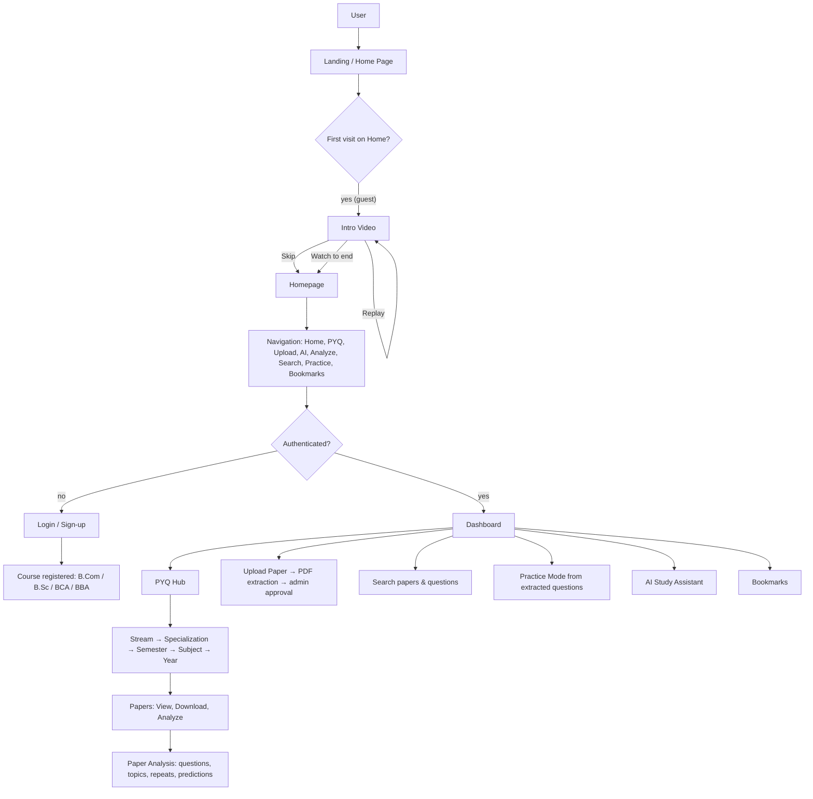

# Smart PYQ Project

**Smart PYQ** is an intelligent previous-year question paper (PYQ) platform for Osmania University. Students browse, upload, search, and download past exam papers organized by course, semester, and subject — and then go further: an AI engine extracts the actual questions from each paper, classifies them by topic and type, finds questions that repeat across years, ranks the most important topics, and helps students practice what matters.

The project is built for B.Com, B.Sc, BCA, and BBA students and adapts its content and access rules to the user's registered course.

## Supported Courses

- 🎓 B.Com
- 🎓 B.Sc
- 🎓 BCA
- 🎓 BBA

## Application Flow



**Notes on the intro video behavior (verified):**

- The intro video plays only on the `/` route for **guests** on a first visit.
- **Skip** dismisses the video and reveals the homepage; **Replay** replays it from the start; letting it finish also proceeds to the homepage.
- After the user is logged in (or after leaving the `/` route), normal navigation **does not** replay the intro.
- Clicking **Home** in the header for a guest re-triggers the intro; for logged-in users it navigates straight to the homepage.

## Features

- **PYQ Hub** — Browse previous-year papers by Stream → Specialization → Semester → Subject → Year.
- **Upload & Share** — Multi-step upload wizard with PDF validation, text extraction, question parsing, and admin approval workflow.
- **Paper Analysis** — A real data pipeline: reads the PDF, extracts each question with section/marks/type/topic, detects repeated questions (exact/similar/concept) across years, computes topic frequency, marks distribution, year-wise breakdowns, and non-guaranteed exam predictions. Single-paper analyses clearly show that repetition insights need multiple papers.
- **Repeated Questions** — See which questions and topics recur across exam years, with per-year evidence.
- **Practice Mode** — Test yourself with questions extracted from actual papers (own-answer + "I knew this / Needs practice" review history).
- **AI Study Assistant** — Chat assistant for concepts, programming, and exam strategy.
- **Search** — Full-text search across papers and extracted questions.
- **Bookmarks** — Save questions/papers for later review.
- **Dashboard & History** — Academic profile, recent activity, practice history, analysis history.
- **Academic Access Control** — Users see content matching their registered course/specialization (admins and demo users see everything).
- **Auth with email OTP** — Registration/sign-in includes email OTP verification; development includes an on-screen fallback code when SMTP is not configured.
- **Demo Mode** — One-click demo login with full platform access (`sumer@edu.in` / `demo123`).

## Technology Stack

| Layer | Technology |
| --- | --- |
| Backend | Python 3.10+ · FastAPI · SQLAlchemy (async) |
| Database | SQLite (development) / Supabase PostgreSQL (production, via Alembic migrations) |
| Storage | Local filesystem (development) / Supabase Storage (production) |
| Auth | JWT (access + refresh) with role-based access |
| Frontend | React 18 · Vite · React Router v6 · Tailwind CSS · Framer Motion · Lucide/Heroicons |
| AI | OpenAI-compatible or Gemini provider (configurable) |

## Project Structure

```
smartpyq/
├── app/                  # FastAPI backend
│   ├── routers/          # auth, papers, analysis, chat, bookmarks, admin, ...
│   ├── services/         # business logic (question extractor, insights, auth, ...)
│   ├── models/           # SQLAlchemy models
│   ├── schemas/          # Pydantic schemas
│   └── utils/            # email, AI clients, Supabase client
├── smartpyq-frontend/    # React + Vite SPA
│   ├── src/
│   │   ├── pages/        # Home, Dashboard, PYQ, Upload, Analyze, Practice, AI, ...
│   │   ├── components/   # Header, Footer, ChatWidget, PYQNavigator, UI kit
│   │   ├── contexts/     # Auth, IntroVideo
│   │   ├── lib/          # API client
│   │   └── data/         # Course/subject catalogs, seed questions
│   └── public/           # Logo, intro/background videos
├── alembic/              # DB migrations
├── supabase/             # Supabase SQL migrations
├── tests/                # Backend test suite (pytest)
├── uploads/              # Local uploaded PDFs (dev only, git-ignored)
├── docs/                 # Architecture & deployment docs
└── .env.example          # Env template (never commit real .env)
```

## Installation

**Prerequisites:** Python 3.10+, Node.js 18+, npm.

```bash
# Backend
python -m venv .venv
source .venv/bin/activate        # Windows: .venv\Scripts\activate
pip install -r requirements.txt
cp .env.example .env             # then fill in real values (see Environment Variables)
python -m alembic upgrade head   # apply DB migrations (or `python -m alembic revision --autogenerate -m "init"` on a fresh DB)

# Frontend
cd smartpyq-frontend
npm install
cp .env.example .env.local  # VITE_BACKEND_URL defaults to http://127.0.0.1:8000
```

## Development

```bash
# Terminal 1 — backend (http://127.0.0.1:8000, API docs at /docs)
python -m uvicorn app.main:app --host 127.0.0.1 --port 8000 --reload

# Terminal 2 — frontend (http://127.0.0.1:5173)
cd smartpyq-frontend && npm run dev
```

Or run `start.bat` on Windows to launch both.

**Demo login:** `sumer@edu.in` / `demo123`.

## Testing

```bash
# Backend test suite (pytest)
python -m pytest -q

# Frontend: no unit-test harness is configured; quality gates are the production build
# and the manual flow below.
cd smartpyq-frontend && npm run build
```

Verified main flows (live UI): landing video skip/replay, guest home, login/sign-up with OTP, PYQ Hub drill-down to papers, paper analysis end-to-end, practice mode, search, and AI chat.

**Current result:** `290 passed, 4 skipped` (backend), frontend `npm run build` succeeds.

## Production Build

```bash
cd smartpyq-frontend
npm run build        # outputs to smartpyq-frontend/dist
npm run preview      # optionally serve the build locally to verify
```

## Deployment

### Vercel (frontend)

1. Push the repository to GitHub, then **Import** it in Vercel.
2. Set the **Root Directory** to `smartpyq-frontend` (the SPA lives there).
3. Vercel auto-detects Vite: build command `npm run build`, output directory `dist`.
4. `smartpyq-frontend/vercel.json` contains an SPA rewrite so deep links like `/analyze` render instead of returning 404.
5. Add the environment variable `VITE_BACKEND_URL` = your hosted backend URL, then redeploy.

> Frontend code is public after deployment by nature — keep secrets on the backend only.

### Backend (hosting the FastAPI API)

The FastAPI backend is **not** part of the Vercel static deployment. Host it on a service that runs Python (e.g. Render, Railway, a VPS with the included `Dockerfile`, or Vercel Serverless Functions if you adapt the app). It needs the environment variables below plus migrations applied.

## Environment Variables

Names only — set real values in your host's environment, never in the repo.

**Backend (`.env`):**

- `ENV`, `DEBUG`, `PORT`, `HOST`, `APP_NAME`, `APP_VERSION`, `API_PREFIX`
- `DATABASE_URL` (Supabase Postgres in production)
- `DB_POOL_SIZE`, `DB_MAX_OVERFLOW`, `DB_POOL_TIMEOUT`, `DB_POOL_RECYCLE`
- `REDIS_URL` (optional cache/queue), `REDIS_*`
- `JWT_SECRET`, `JWT_ALGORITHM`, `JWT_ACCESS_EXPIRE_SECONDS`, `JWT_REFRESH_EXPIRE_SECONDS`
- AI: `GEMINI_API_KEY` **or** `OPENAI_API_KEY` + `OPENAI_BASE_URL` + `OPENAI_MODEL`; `AI_DEFAULT_MODEL`, `AI_MAX_TOKENS`, `AI_TEMPERATURE`, `AI_TIMEOUT_SECONDS`
- Storage: `STORAGE_BACKEND`, `SUPABASE_URL`, `SUPABASE_ANON_KEY`, `SUPABASE_PUBLISHABLE_KEY`, `SUPABASE_SECRET_KEY`, `SUPABASE_SERVICE_ROLE_KEY`, `SUPABASE_JWKS_URL`, `SUPABASE_STORAGE_BUCKET` (or Firebase/AWS equivalents)
- Email OTP: `SMTP_HOST`, `SMTP_PORT`, `SMTP_USERNAME`, `SMTP_PASSWORD`, `SMTP_FROM`

**Frontend (`smartpyq-frontend/.env.local`):**

- `VITE_BACKEND_URL` — the backend API origin, e.g. `http://127.0.0.1:8000` locally or your hosted URL in production.

See `.env.example` for the full template.

## Documentation

- `docs/ARCHITECTURE.md`, `docs/DEPLOYMENT.md`, `docs/BACKUP_RESTORE.md` — architecture and operations.

## License

MIT License — see [LICENSE](LICENSE) for details.
